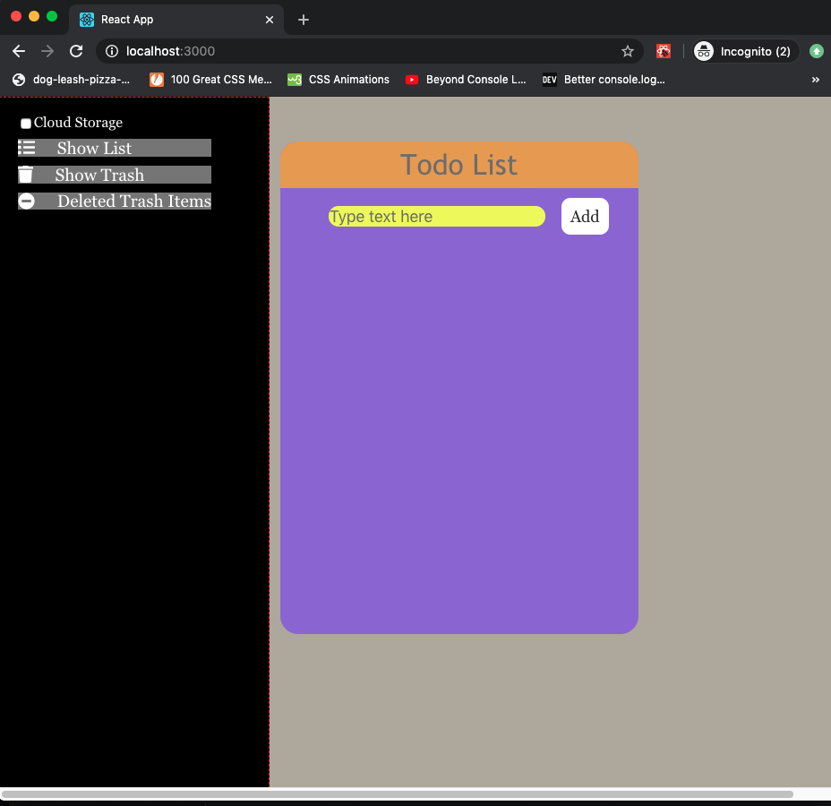

## Introduction

This is a sample project using React JS. 
The project is a Todo-List system, the following
are some done features and some features to be done:

### Done:
    Shows elements saved to localStorage
    Add/delete elements to/from localStorage
    Handle React state
    Pass information from parent to child component
    Use route for diferent paths definitions
    Reuse component passing props through Route
    Use Redux to handle the state of the application.
    Add some tests

### To be done:
    Connect to AWS to store the list items
    Connect to AWS to store deleted list items
    Use Authentication-Amplify to get authorization per user
    After enter in textbox should add, now clear the text.
    X - Use Hooks to handle Life-Cycle functions in functional components instead of class components

